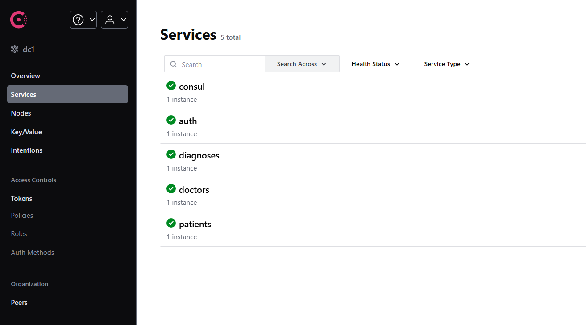

# 🌐 .NET Microservices Architecture  

Welcome to the **.NET Microservices Application** repository! This project is an enterprise-grade solution designed to leverage the power of microservices architecture, ensuring scalability, flexibility, and maintainability. Each service is built with **clean architecture** principles combined with a **hexagonal design**, following industry best practices.  

## 🛠️ Key Features  

1. **Service Discovery with Consul**:  
   - All services register dynamically with **Consul**, enabling the API Gateway to discover and connect with them seamlessly.  
   
   

2. **Inter-service Communication with RabbitMQ**:  
   - Reliable and efficient communication between microservices is handled through **RabbitMQ**, ensuring event-driven architecture and asynchronous processing.  

3. **Distributed Tracing and Monitoring**:  
   - Integrated **OpenTelemetry** for observability across the system.  
   - Health checks ensure each service is operating optimally.  

4. **JWT Authentication**:  
   - Secured endpoints using **JWT tokens**, enhancing authentication and authorization mechanisms.  

5. **Microservices**:  
   - **Auth Service**: Handles user authentication and authorization.  
   - **Doctors Service**: Manages doctor information and schedules.  
   - **Patients Service**: Manages patient records and interactions.  
   - **Diagnoses Service**: Stores and retrieves medical diagnoses.  

6. **Databases**:  
   - **PostgreSQL**: Relational database for structured data.  
   - **MongoDB**: NoSQL database for document-oriented storage.  
   - **Redis**: In-memory database for caching and session storage.  

7. **Design Patterns**:  
   - **CQRS**: Separates write and read operations for scalability.  
   - **Request/Response**: Ensures clear communication between components.  
   - **Decorator**: Enhances functionality without modifying core logic.  
   - **Repository, Factory, Builder, Singleton**: Applied for maintainability and reusability.  

8. **Modern Tools and Libraries**:  
   - **EF Core** with **Fluent API** for model definitions and migrations.  
   - **MassTransit** for RabbitMQ integration.  
   - **Fluent Validations** for robust input validation.  
   - **MongoDB.Driver** for interacting with MongoDB.  

9. **API Gateway**:  
   - Middleware handles query validation, routing, and enhances security.  

10. **Pre-compilation of Entities for Performance**:  
   - To enhance performance, this architecture uses **pre-compiled entities** to minimize the overhead during startup.  
   - Entities in the database are precompiled and optimized before use, which significantly reduces the initialization time.  
   - This helps improve the efficiency of entity framework operations, particularly in scenarios involving large-scale data retrieval and intensive queries.

11. **Best Practices**:  
   - Adheres to **SOLID**, **KISS**, and object-oriented principles.  
   - Utilizes **precompiled entities** and **compiled queries** in EF Core for performance optimization.  
   - Built with testability and maintainability in mind.  

## 🏗️ Architecture  

- **Microservices**: Each service is independently deployable and encapsulates its own domain logic.  
- **Clean Architecture**: Ensures separation of concerns with clearly defined layers.  
- **Hexagonal Design**: Promotes testability and isolates the core logic from external dependencies.  

## 🚀 How It Works  

1. **Service Registration**:  
   - Each service registers with **Consul**, making itself discoverable to the API Gateway.  

2. **Communication**:  
   - Asynchronous messaging via **RabbitMQ** for decoupled and reliable inter-service communication.  

3. **Observability**:  
   - Health checks and distributed tracing through **OpenTelemetry**, ensuring smooth debugging and performance monitoring.  

4. **Secure Access**:  
   - All API requests are validated and authenticated with **JWT**, ensuring secure communication.  

## 🤝 Why Choose This Architecture?  

This project is designed for enterprise-grade applications, where scalability, reliability, and maintainability are critical. By combining microservices architecture with clean and hexagonal design principles, it ensures:  
- High performance and low coupling.  
- Seamless scaling of individual services.  
- Future-proof architecture for evolving business needs.  

---

Feel free to explore the repository and let me know if you’re interested in collaborating or learning more about the system. Together, we can build innovative and reliable solutions!  
